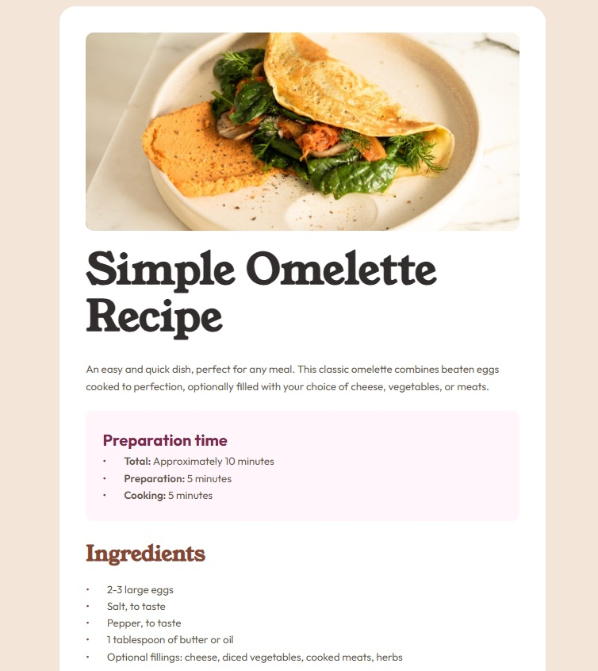

# Recipe Page

A responsive recipe page built from a design comp.

**[Live demo](https://d1mamometr.github.io/recipe-page/)**



## Overview

A single-page recipe layout with a nutrition table, responsive from 375px to desktop.

## Built with

- Semantic HTML5
- CSS custom properties
- CSS Grid and Flexbox
- Mobile-first workflow

## Implementation notes

- Nutrition facts marked up as a description list (`<dl>`) rather than a table — the data is key–value pairs, not a two-dimensional grid
- Custom list markers via `::before` and CSS counters, giving consistent spacing across ordered and unordered lists
- Full-bleed hero image on mobile achieved by moving horizontal padding to an inner wrapper

## Running locally

```bash
git clone git@github.com:d1mamometr/recipe-page.git
cd recipe-page
```

Open `index.html` in a browser.